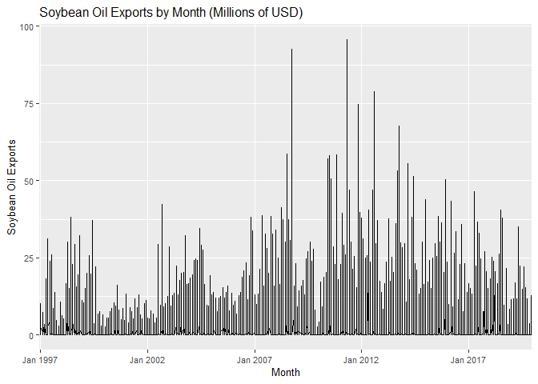
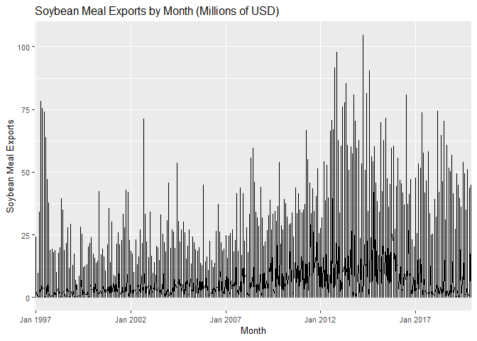
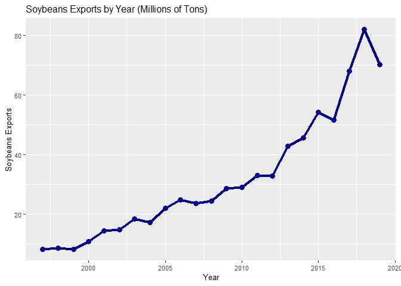
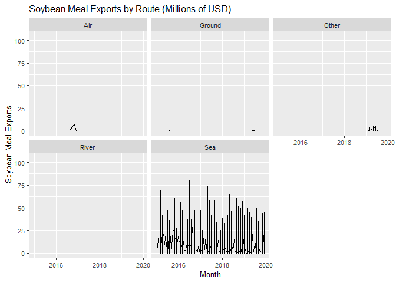
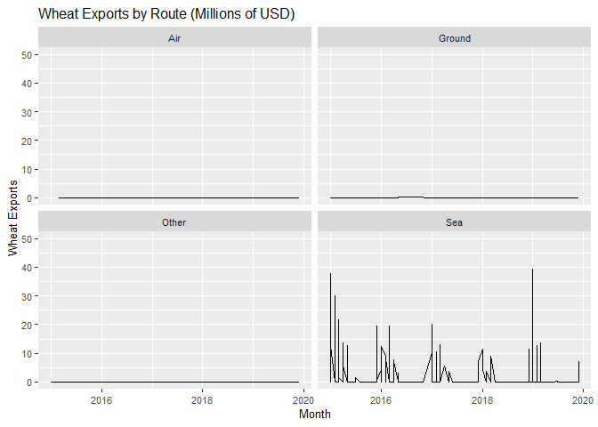
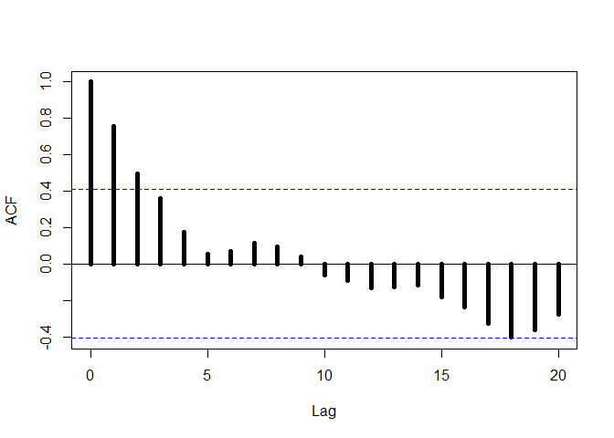

## Challenge 2

Let's begin installing the packages.

```
## -- Attaching packages ---------------------------------- tidyverse 1.3.0 --
```

```
## v ggplot2 3.3.2     v purrr   0.3.3
## v tibble  3.0.1     v dplyr   0.8.5
## v tidyr   1.0.2     v stringr 1.4.0
## v readr   1.3.1     v forcats 0.4.0
```

```
## -- Conflicts ------------------------------------- tidyverse_conflicts() --
## x dplyr::filter() masks stats::filter()
## x dplyr::lag()    masks stats::lag()
```

```
## 
## Attaching package: 'lubridate'
```

```
## The following object is masked from 'package:base':
## 
##     date
```

Now we choose the directory and open the data file.

```r
setwd("C:/Users/Caique/Desktop/Mestrado_FEARP/Processo_seletivo/4intelligence/Challenge_2")
comexstat = read.csv("C:/Users/Caique/Desktop/Mestrado_FEARP/Processo_seletivo/4intelligence/Challenge_4i/data_comexstat.csv")
```

# Question 1

We begin transforming the date variable into a date format.

```r
comexstat$date = as.Date(comexstat$date)
```

And we are ready to make the monthly graphs. The first two are soybeans export graphs (tons and dollars).


```r
ggplot(filter(comexstat, type == "Export" & product == "soybeans"),aes(x=as.character(date),y=tons/1000,group=1)) +
  ggtitle("Soybeans Exports by Month (Tons x1000)") +
  theme(text = element_text(size=10)) +
  labs(x = "Month", y = "Soybeans Exports") +
  scale_x_discrete(breaks = c("1997-01-01", "2002-01-01", "2007-01-01", "2012-01-01", "2017-01-01"), 
                   labels = c("Jan 1997", "Jan 2002", "Jan 2007", "Jan 2012", "Jan 2017")) +
  geom_line()
```

<!-- -->

```r
ggplot(filter(comexstat, type == "Export" & product == "soybeans"),aes(x=as.character(date),y=usd/1000000,group=1)) +
  ggtitle("Soybeans Exports by Month (Millions of USD)") +
  theme(text = element_text(size=10)) +
  labs(x = "Month", y = "Soybeans Exports") +
  scale_x_discrete(breaks = c("1997-01-01", "2002-01-01", "2007-01-01", "2012-01-01", "2017-01-01"), 
                   labels = c("Jan 1997", "Jan 2002", "Jan 2007", "Jan 2012", "Jan 2017")) +
  geom_line()
```

<!-- -->

The second product we observe the monthly evolution is soybean oil.

```r
ggplot(filter(comexstat, type == "Export" & product == "soybean_oil"),aes(x=as.character(date),y=tons/1000,group=1)) +
  ggtitle("Soybean Oil Exports by Month (Tons x1000)") +
  theme(text = element_text(size=10)) +
  labs(x = "Month", y = "Soybean Oil Exports") +
  scale_x_discrete(breaks = c("1997-01-01", "2002-01-01", "2007-01-01", "2012-01-01", "2017-01-01"), 
                   labels = c("Jan 1997", "Jan 2002", "Jan 2007", "Jan 2012", "Jan 2017")) +
  geom_line()
```

<!-- -->

```r
ggplot(filter(comexstat, type == "Export" & product == "soybean_oil"),aes(x=as.character(date),y=usd/1000000,group=1)) +
  ggtitle("Soybean Oil Exports by Month (Millions of USD)") +
  theme(text = element_text(size=10)) +
  labs(x = "Month", y = "Soybean Oil Exports") +
  scale_x_discrete(breaks = c("1997-01-01", "2002-01-01", "2007-01-01", "2012-01-01", "2017-01-01"), 
                   labels = c("Jan 1997", "Jan 2002", "Jan 2007", "Jan 2012", "Jan 2017")) +
  geom_line()
```

<!-- -->

Finally, we have the soybean meal graphs.

```r
ggplot(filter(comexstat, type == "Export" & product == "soybean_meal"),aes(x=as.character(date),y=tons/1000,group=1)) +
  ggtitle("Soybean Meal Exports by Month (Tons x1000)") +
  theme(text = element_text(size=10)) +
  labs(x = "Month", y = "Soybean Meal Exports") +
  scale_x_discrete(breaks = c("1997-01-01", "2002-01-01", "2007-01-01", "2012-01-01", "2017-01-01"), 
                   labels = c("Jan 1997", "Jan 2002", "Jan 2007", "Jan 2012", "Jan 2017")) +
  geom_line()
```

<!-- -->

```r
ggplot(filter(comexstat, type == "Export" & product == "soybean_meal"),aes(x=as.character(date),y=usd/1000000,group=1)) +
  ggtitle("Soybean Meal Exports by Month (Millions of USD)") +
  theme(text = element_text(size=10)) +
  labs(x = "Month", y = "Soybean Meal Exports") +
  scale_x_discrete(breaks = c("1997-01-01", "2002-01-01", "2007-01-01", "2012-01-01", "2017-01-01"), 
                   labels = c("Jan 1997", "Jan 2002", "Jan 2007", "Jan 2012", "Jan 2017")) +
  geom_line()
```

<!-- -->

To make the year graphs, we decided to construct new data bases with periods being years. We did that aggregating the monthly data into years by sum.

```r
soybeans_exp_year = aggregate(cbind(tons, usd)~year(date), 
                              data = filter(comexstat, type == "Export" & 
                                              product == "soybeans"), FUN = sum)
soybean_oil_exp_year = aggregate(cbind(tons, usd)~year(date), 
                                 data = filter(comexstat, type == "Export" & 
                                                 product == "soybean_oil"), FUN = sum)
soybean_meal_exp_year = aggregate(cbind(tons, usd)~year(date), 
                                  data = filter(comexstat, type == "Export" & 
                                                  product == "soybean_meal"), FUN = sum)
```

Again, we have export graphs with tons and dollars, as the products are the same as the monthly graphs.

```r
ggplot(soybeans_exp_year, aes(x=`year(date)`, y = tons/1000000, group=1)) +
  ggtitle("Soybeans Exports by Year (Millions of Tons)") +
  theme(text = element_text(size=10)) +
  labs(x = "Year", y = "Soybeans Exports") +
  geom_line(color="blue4", size=1.5) +
  geom_point(color="blue4", size=3)
```

<!-- -->

```r
ggplot(soybeans_exp_year, aes(x=`year(date)`, y = usd/1000000, group=1)) +
  ggtitle("Soybeans Exports by Year (Millions of USD)") +
  theme(text = element_text(size=10)) +
  labs(x = "Year", y = "Soybeans Exports") +
  geom_line(color="blue4", size=1.5) +
  geom_point(color="blue4", size=3)
```

<!-- -->

```r
ggplot(soybean_oil_exp_year, aes(x=`year(date)`, y = tons/1000000, group=1)) +
  ggtitle("Soybean Oil Exports by Year (Millions of Tons)") +
  theme(text = element_text(size=10)) +
  labs(x = "Year", y = "Soybean Oil Exports") +
  geom_line(color="green4", size=1.5) +
  geom_point(color="green4", size=3)
```

<!-- -->

```r
ggplot(soybean_oil_exp_year, aes(x=`year(date)`, y = usd/1000000, group=1)) +
  ggtitle("Soybean Oil Exports by Year (Millions of USD)") +
  theme(text = element_text(size=10)) +
  labs(x = "Year", y = "Soybean Oil Exports") +
  geom_line(color="green4", size=1.5) +
  geom_point(color="green4", size=3)
```

<!-- -->

```r
ggplot(soybean_meal_exp_year, aes(x=`year(date)`, y = tons/1000000, group=1)) +
  ggtitle("Soybean Meal Exports by Year (Millions of Tons)") +
  theme(text = element_text(size=10)) +
  labs(x = "Year", y = "Soybean Meal Exports") +
  geom_line(color="red4", size=1.5) +
  geom_point(color="red4", size=3)
```

<!-- -->

```r
ggplot(soybean_meal_exp_year, aes(x=`year(date)`, y = usd/1000000, group=1)) +
  ggtitle("Soybean Meal Exports by Year (Millions of USD)") +
  theme(text = element_text(size=10)) +
  labs(x = "Year", y = "Soybean Meal Exports") +
  geom_line(color="red4", size=1.5) +
  geom_point(color="red4", size=3)
```

<!-- -->

# Question 2

Let's begin by constructing a yearly data base of the products exports. We aggregate the remaining products and then create a joint database with all the products exports (in USD) by year.

```r
sugar_exp_year = aggregate(cbind(tons, usd)~year(date), 
                              data = filter(comexstat, type == "Export" & 
                                              product == "sugar"), FUN = sum)
corn_exp_year = aggregate(cbind(tons, usd)~year(date), 
                              data = filter(comexstat, type == "Export" & 
                                              product == "corn"), FUN = sum)
wheat_exp_year = aggregate(cbind(tons, usd)~year(date), 
                              data = filter(comexstat, type == "Export" & 
                                              product == "wheat"), FUN = sum)
comexstat_year = soybeans_exp_year
comexstat_year$soy_oil = soybean_oil_exp_year$usd
comexstat_year$soy_meal = soybean_meal_exp_year$usd
comexstat_year$sugar = sugar_exp_year$usd
comexstat_year$corn = corn_exp_year$usd
```

The wheat data have less periods, so we add missing values to the data base. We also modify the data base to have a cleaner ambient.

```r
wheat_exp_year = add_row(wheat_exp_year, `year(date)` = 1997:2002, .before = 1)
wheat_exp_year = add_row(wheat_exp_year, `year(date)` = 2007, tons = 0, usd = 0, .before = 11)

comexstat_year$wheat = wheat_exp_year$usd
names(comexstat_year)[3] = "soybeans"
comexstat_year = comexstat_year %>% select(-2)
```

The next graph compares the exports (in MUSD) of the six different products, focusing on the last 5 years (after the vertical line).

```r
ggplot(comexstat_year,aes(x =`year(date)`)) +
  ggtitle("Brazilian Exports by Year (Millions of USD)") +
  theme(text = element_text(size=10)) +
  geom_line(aes(y = soybeans/1000000, colour = "Soybeans")) +
  geom_line(aes(y = soy_oil/1000000, colour = "Soy oil")) +
  geom_line(aes(y = soy_meal/1000000, colour = "Soy meal")) +
  geom_line(aes(y = corn/1000000, colour = "Corn")) +
  geom_line(aes(y = sugar/1000000, colour = "Sugar")) +
  geom_line(aes(y = wheat/1000000, colour = "Wheat")) +
  labs(x = "Year", y = "Exports", colour = "Product") +
  geom_vline(xintercept = 2014)
```

```
## Warning: Removed 6 row(s) containing missing values (geom_path).
```

<!-- -->

We also sum the exports values from the last 5 years. The 3 most important products exported from Brazil in the last 5 years are soybeans (123,325.5 MUSD in total exports), sugar (40,938.49 MUSD in total exports), and soy meal (28.407,72 MUSD in total exports). Corn surpassed both sugar and soy meal in the last year, tough. 

```r
kable(sum(comexstat_year$soybeans[19:23]/1000000), col.names = "Soybeans (MUSD)", format.args = list(big.mark = ",", scientific = FALSE), format = "markdown")
```


| Soybeans (MUSD)|
|---------------:|
|       123,325.5|

```r
kable(sum(comexstat_year$soy_oil[19:23]/1000000), col.names = "Soy oil (MUSD)", format.args = list(big.mark = ",", scientific = FALSE), format = "markdown")
```


| Soy oil (MUSD)|
|--------------:|
|      4,795.947|

```r
kable(sum(comexstat_year$soy_meal[19:23]/1000000), col.names = "Soy meal (MUSD)", format.args = list(big.mark = ",", scientific = FALSE), format = "markdown")
```


| Soy meal (MUSD)|
|---------------:|
|       28,407.72|

```r
kable(sum(comexstat_year$corn[19:23]/1000000), col.names = "Corn (MUSD)", format.args = list(big.mark = ",", scientific = FALSE), format = "markdown")
```


| Corn (MUSD)|
|-----------:|
|   24,447.72|

```r
kable(sum(comexstat_year$sugar[19:23]/1000000), col.names = "Sugar (MUSD)", format.args = list(big.mark = ",", scientific = FALSE), format = "markdown")
```


| Sugar (MUSD)|
|------------:|
|    40,938.49|

```r
kable(sum(comexstat_year$wheat[19:23]/1000000), col.names = "Wheat (MUSD)", format.args = list(big.mark = ",", scientific = FALSE), format = "markdown")
```


| Wheat (MUSD)|
|------------:|
|     726.9454|

# Question 3

We create a data base aggregating the corn exports by route, summing the values of the last 5 years. Then, we present an ordered table with the exports by route in USD. The most important corn export route is sea, followed by river.

```r
corn_route = aggregate(cbind(usd)~route, data = filter(comexstat, 
                                                           product == "corn" & 
                                                             type == "Export" & 
                                                             date > as.Date("2015-01-01")), 
                           FUN = sum)

kable(arrange(corn_route, desc(usd)), format.args = list(big.mark = ",", scientific = FALSE), col.names = c("Route", "Corn Exports - USD"), format = "markdown")
```


|Route  | Corn Exports - USD|
|:------|------------------:|
|Sea    |     22,688,665,107|
|River  |        944,146,881|
|Ground |        168,550,371|
|Other  |         44,078,699|
|Air    |          4,319,297|

The graph shows monthly exports by route, and the importance of sea is clear.

```r
ggplot(filter(comexstat, type == "Export" & product == "corn"),aes(x=date,y=usd/1000000,group = 1)) +
  ggtitle("Corn Exports by Route (Millions of USD)") +
  theme(text = element_text(size=10)) +
  labs(x = "Month", y = "Corn Exports") +
  scale_x_date(limits = as.Date(c("2015-01-01", "2019-12-01"))) +
  facet_wrap(~route) +
  geom_line()
```

```
## Warning: Removed 7393 row(s) containing missing values (geom_path).
```

<!-- -->

Regarding the other products, the importance of sea routes is even bigger than corn exports sea predominance. The river routes are far less important considering all the products, except for soybeans.

```r
soybeans_route = aggregate(cbind(usd)~route, data = filter(comexstat, 
                                                           product == "soybeans" & 
                                                             type == "Export" & 
                                                             date > as.Date("2015-01-01")), 
                           FUN = sum)

kable(arrange(soybeans_route, desc(usd)), format.args = list(big.mark = ",", scientific = FALSE), col.names = c("Route", "Soybeans Exports - USD"), format = "markdown")
```


|Route  | Soybeans Exports - USD|
|:------|----------------------:|
|Sea    |        119,462,994,908|
|River  |          3,241,919,462|
|Other  |            542,343,604|
|Ground |             43,059,249|
|Air    |                109,909|

```r
ggplot(filter(comexstat, type == "Export" & product == "soybeans"),aes(x=date,y=usd/1000000,group = 1)) +
  ggtitle("Soybeans Exports by Route (Millions of USD)") +
  theme(text = element_text(size=10)) +
  labs(x = "Month", y = "Soybeans Exports") +
  scale_x_date(limits = as.Date(c("2015-01-01", "2019-12-01"))) +
  facet_wrap(~route) +
  geom_line()
```

```
## Warning: Removed 13491 row(s) containing missing values (geom_path).
```

<!-- -->

```r
soybean_meal_route = aggregate(cbind(usd)~route, data = filter(comexstat, 
                                                           product == "soybean_meal" & 
                                                             type == "Export" & 
                                                             date > as.Date("2015-01-01")), 
                           FUN = sum)

kable(arrange(soybean_meal_route, desc(usd)), format.args = list(big.mark = ",", scientific = FALSE), col.names = c("Route", "Soybean Meal Exports - USD"), format = "markdown")
```


|Route  | Soybean Meal Exports - USD|
|:------|--------------------------:|
|Sea    |             27,956,644,185|
|Other  |                 30,536,840|
|Air    |                  8,030,901|
|Ground |                  4,946,577|
|River  |                     70,590|

```r
ggplot(filter(comexstat, type == "Export" & product == "soybean_meal"),aes(x=date,y=usd/1000000,group = 1)) +
  ggtitle("Soybean Meal Exports by Route (Millions of USD)") +
  theme(text = element_text(size=10)) +
  labs(x = "Month", y = "Soybean Meal Exports") +
  scale_x_date(limits = as.Date(c("2015-01-01", "2019-12-01"))) +
  facet_wrap(~route) +
  geom_line()
```

```
## Warning: Removed 12218 row(s) containing missing values (geom_path).
```

<!-- -->

```r
soybean_oil_route = aggregate(cbind(usd)~route, data = filter(comexstat, 
                                                           product == "soybean_oil" & 
                                                             type == "Export" & 
                                                             date > as.Date("2015-01-01")), 
                           FUN = sum)

kable(arrange(soybean_oil_route, desc(usd)), format.args = list(big.mark = ",", scientific = FALSE), col.names = c("Route", "Soybean Oil Exports - USD"), format = "markdown")
```


|Route  | Soybean Oil Exports - USD|
|:------|-------------------------:|
|Sea    |             4,563,697,443|
|Ground |               125,282,509|
|Other  |                24,410,767|
|River  |                 3,356,822|
|Air    |                     4,248|

```r
ggplot(filter(comexstat, type == "Export" & product == "soybean_oil"),aes(x=date,y=usd/1000000,group = 1)) +
  ggtitle("Soybean Oil Exports by Route (Millions of USD)") +
  theme(text = element_text(size=10)) +
  labs(x = "Month", y = "Soybean Oil Exports") +
  scale_x_date(limits = as.Date(c("2015-01-01", "2019-12-01"))) +
  facet_wrap(~route) +
  geom_line()
```

```
## Warning: Removed 8196 row(s) containing missing values (geom_path).
```

<!-- -->

```r
sugar_route = aggregate(cbind(usd)~route, data = filter(comexstat, 
                                                           product == "sugar" & 
                                                             type == "Export" & 
                                                             date > as.Date("2015-01-01")), 
                           FUN = sum)

kable(arrange(sugar_route, desc(usd)), format.args = list(big.mark = ",", scientific = FALSE), col.names = c("Route", "Sugar Exports - USD"), format = "markdown")
```


|Route  | Sugar Exports - USD|
|:------|-------------------:|
|Sea    |      39,831,266,240|
|Ground |         246,415,441|
|Other  |          20,510,408|
|River  |          17,247,288|
|Air    |              36,400|

```r
ggplot(filter(comexstat, type == "Export" & product == "sugar"),aes(x=date,y=usd/1000000,group = 1)) +
  ggtitle("Sugar Exports by Route (Millions of USD)") +
  theme(text = element_text(size=10)) +
  labs(x = "Month", y = "Sugar Exports") +
  scale_x_date(limits = as.Date(c("2015-01-01", "2019-12-01"))) +
  facet_wrap(~route) +
  geom_line()
```

```
## Warning: Removed 17589 row(s) containing missing values (geom_path).
```

<!-- -->

```r
wheat_route = aggregate(cbind(usd)~route, data = filter(comexstat, 
                                                           product == "wheat" & 
                                                             type == "Export" & 
                                                             date > as.Date("2015-01-01")), 
                           FUN = sum)

kable(arrange(wheat_route, desc(usd)), format.args = list(big.mark = ",", scientific = FALSE), col.names = c("Route", "Wheat Exports - USD"), format = "markdown")
```


|Route  | Wheat Exports - USD|
|:------|-------------------:|
|Sea    |         612,599,570|
|Ground |             821,269|
|Other  |              16,633|
|Air    |               2,139|

```r
ggplot(filter(comexstat, type == "Export" & product == "wheat"),aes(x=date,y=usd/1000000,group = 1)) +
  ggtitle("Wheat Exports by Route (Millions of USD)") +
  theme(text = element_text(size=10)) +
  labs(x = "Month", y = "Wheat Exports") +
  scale_x_date(limits = as.Date(c("2015-01-01", "2019-12-01"))) +
  facet_wrap(~route) +
  geom_line()
```

```
## Warning: Removed 215 row(s) containing missing values (geom_path).
```

<!-- -->

# Question 4

We begin creating a year variable in the main data base. Then, we create new data bases filtering by corn and sugar exports in the last 3 years. Then, we aggregate by summing the last 3 years corn/sugar exports by each trade partner. The tables below shows the results.

```r
comexstat$year = year(comexstat$date)

corn3 = comexstat %>%
  filter(product == "corn" & type == "Export" & year > 2016)

sugar3 = comexstat %>%
  filter(product == "sugar" & type == "Export" & year > 2016)

corn_country3 = aggregate(cbind(usd)~country, data = corn3, FUN = sum)

sugar_country3 = aggregate(cbind(usd)~country, data = sugar3, FUN = sum)

kable(head(arrange(corn_country3, desc(usd))), 
      format.args = list(big.mark = ",", scientific = FALSE), 
      col.names = c("Country", "Corn Total Exports - USD"), format = "markdown")
```


|Country     | Corn Total Exports - USD|
|:-----------|------------------------:|
|Iran        |            2,822,336,281|
|Japan       |            1,574,975,592|
|Vietnam     |            1,551,035,208|
|Egypt       |            1,375,065,136|
|Spain       |            1,335,769,607|
|South Korea |            1,024,567,902|

```r
kable(head(arrange(sugar_country3, desc(usd))), 
      format.args = list(big.mark = ",", scientific = FALSE), 
      col.names = c("Country", "Sugar Total Exports - USD"), format = "markdown")
```


|Country              | Sugar Total Exports - USD|
|:--------------------|-------------------------:|
|Algeria              |             2,176,380,928|
|Bangladesh           |             2,063,174,600|
|India                |             1,696,094,938|
|United Arab Emirates |             1,538,397,895|
|Saudi Arabia         |             1,380,455,693|
|Nigeria              |             1,336,515,029|

# Question 5

Similar to the Question 4, we aggregate the exports by summing all the years separating by state. The results for all the six products are presented in the tables below.

```r
soybeans_uf = aggregate(cbind(usd)~state, data = filter(comexstat, product == "soybeans"
                                                        & type == "Export"), FUN = sum)
kable(head(arrange(soybeans_uf, desc(usd))), 
      format.args = list(big.mark = ",", scientific = FALSE), 
      col.names = c("State", "Soybeans Total Exports - USD"), format = "markdown")
```


|State | Soybeans Total Exports - USD|
|:-----|----------------------------:|
|MT    |               80,506,781,707|
|PR    |               48,484,101,052|
|RS    |               46,136,733,396|
|GO    |               21,268,827,303|
|MS    |               13,284,815,678|
|SP    |               12,770,892,655|

```r
soybean_meal_uf = aggregate(cbind(usd)~state, data = filter(comexstat, product == "soybean_meal"
                                                        & type == "Export"), FUN = sum)
kable(head(arrange(soybean_meal_uf, desc(usd))), 
      format.args = list(big.mark = ",", scientific = FALSE), 
      col.names = c("State", "Soybean Meal Total Exports - USD"), format = "markdown")
```


|State | Soybean Meal Total Exports - USD|
|:-----|--------------------------------:|
|MT    |                   27,994,539,842|
|PR    |                   24,649,962,821|
|RS    |                   15,007,385,729|
|GO    |                    9,421,430,703|
|BA    |                    5,439,265,638|
|SP    |                    4,273,385,780|

```r
soybean_oil_uf = aggregate(cbind(usd)~state, data = filter(comexstat, product == "soybean_oil"
                                                        & type == "Export"), FUN = sum)
kable(head(arrange(soybean_oil_uf, desc(usd))), 
      format.args = list(big.mark = ",", scientific = FALSE), 
      col.names = c("State", "Soybean Oil Total Exports - USD"), format = "markdown")
```


|State | Soybean Oil Total Exports - USD|
|:-----|-------------------------------:|
|PR    |                  11,109,102,057|
|RS    |                   6,281,965,055|
|MT    |                   5,434,513,926|
|SC    |                   1,238,810,673|
|GO    |                     855,920,734|
|MG    |                     714,561,462|

```r
corn_uf = aggregate(cbind(usd)~state, data = filter(comexstat, product == "corn"
                                                        & type == "Export"), FUN = sum)
kable(head(arrange(corn_uf, desc(usd))), 
      format.args = list(big.mark = ",", scientific = FALSE), 
      col.names = c("State", "Corn Total Exports - USD"), format = "markdown")
```


|State | Corn Total Exports - USD|
|:-----|------------------------:|
|MT    |           28,375,516,035|
|PR    |            9,160,511,995|
|GO    |            5,706,990,655|
|MS    |            3,405,430,680|
|SP    |            1,511,121,926|
|RS    |            1,209,460,262|

```r
sugar_uf = aggregate(cbind(usd)~state, data = filter(comexstat, product == "sugar"
                                                    & type == "Export"), FUN = sum)
kable(head(arrange(sugar_uf, desc(usd))), 
      format.args = list(big.mark = ",", scientific = FALSE), 
      col.names = c("State", "Sugar Total Exports - USD"), format = "markdown")
```


|State | Sugar Total Exports - USD|
|:-----|-------------------------:|
|SP    |            66,211,861,392|
|MG    |             8,559,401,218|
|PR    |             8,270,778,644|
|AL    |             4,826,419,200|
|MS    |             3,219,034,929|
|GO    |             3,040,882,114|

```r
wheat_uf = aggregate(cbind(usd)~state, data = filter(comexstat, product == "wheat"
                                                    & type == "Export"), FUN = sum)
kable(head(arrange(wheat_uf, desc(usd))), 
      format.args = list(big.mark = ",", scientific = FALSE), 
      col.names = c("State", "Wheat Total Exports - USD"), format = "markdown")
```


|State | Wheat Total Exports - USD|
|:-----|-------------------------:|
|RS    |             1,555,925,283|
|PR    |               183,935,397|
|SC    |                25,400,089|
|SP    |                 2,267,024|
|MS    |                   275,733|
|MG    |                    39,600|

# Question 6

First of all, let's open the covariates data base. We do that by copying the Excel sheet and then running the code below (We've also filtered the values on Excel to select the data from 1997 to 2030).

```r
covariates = read.table(file = "clipboard", sep = "\t", header=TRUE)
```

Similar to Question 4, we classify the most important trade partners for each of the products we are going to model. This time, the classification in by tons instead of dollars, as we consider all the available dates.

```r
soybeans_ctr = aggregate(cbind(tons)~country, 
                         data = filter(comexstat, product == "soybeans" & 
                                         type == "Export"), FUN = sum)
kable(head(arrange(soybeans_ctr, desc(tons))), 
      booktabs = TRUE, format.args = list(big.mark = ",", scientific = FALSE), 
      col.names = c("Country", "Soybeans Total Exports - Tons"), format = "markdown")
```


|Country     | Soybeans Total Exports - Tons|
|:-----------|-----------------------------:|
|China       |                   462,112,012|
|Netherlands |                    56,328,976|
|Spain       |                    40,938,099|
|Thailand    |                    18,780,945|
|Germany     |                    18,658,585|
|Italy       |                    12,708,318|

```r
soybean_meal_ctr = aggregate(cbind(tons)~country, 
                         data = filter(comexstat, product == "soybean_meal" & 
                                         type == "Export"), FUN = sum)
knitr::kable(head(arrange(soybean_meal_ctr, desc(tons))), 
             booktabs = TRUE, format.args = list(big.mark = ",", scientific = FALSE), 
      col.names = c("Country", "Soybean Meal Total Exports - Tons"), format = "markdown")
```


|Country     | Soybean Meal Total Exports - Tons|
|:-----------|---------------------------------:|
|Netherlands |                        71,439,005|
|France      |                        47,988,906|
|Germany     |                        24,414,845|
|Thailand    |                        23,024,506|
|South Korea |                        18,847,461|
|Indonesia   |                        15,742,358|

```r
corn_ctr = aggregate(cbind(tons)~country, 
                         data = filter(comexstat, product == "corn" & 
                                         type == "Export"), FUN = sum)
kable(head(arrange(corn_ctr, desc(tons))), 
      booktabs = TRUE, format.args = list(big.mark = ",", scientific = FALSE), 
      col.names = c("Country", "Corn Total Exports - Tons"), format = "markdown")
```


|Country     | Corn Total Exports - Tons|
|:-----------|-------------------------:|
|Iran        |                48,801,136|
|Japan       |                26,116,657|
|South Korea |                25,485,112|
|Vietnam     |                22,105,049|
|Spain       |                19,549,095|
|Taiwan      |                17,483,869|

The first is the soybeans exports model. We use the yearly data base created in the Question 1 to analyse the ACF and PACF functions (as well as the year graph presented in the Question 1). The time series has a trend, and the ACF and PACF allows us to think about an autorregressive behavior of order 1.

```r
# Soybeans model

acf(soybeans_exp_year$tons, lag.max = 20, lwd = 5, main = "")
```

<!-- -->

```r
pacf(soybeans_exp_year$tons, lag.max = 20, lwd = 5, main = "")
```

<!-- -->

With that in mind, we choose an ARIMA aproach. The order selected is ARIMA(1,1,0), given the characteristics of the time series. The following steps are going to be repeated for the other models. First, we create a covariates time series for the soybeans model. For all the models he select the price variable and the GDP of an important trade partner. In the soybeans case, that is China.

```r
cov_soybeans = covariates %>%
  select(price_soybeans, gdp_china)

cov_soybeans = ts(cov_soybeans)
```

Then, we separate the series in past values (before 2020) and future values (after 2019). 

```r
reg1 = window(cov_soybeans, end = 23) # past values
forec1 = window(cov_soybeans, start = 24) # future values
```

The regression (fit1) uses the covariates past values, and the forecast (forecast1) uses the covariates future values. We present the graph with the forecast.

```r
fit1 = Arima(soybeans_exp_year$tons, xreg = reg1, order = c(1,1,0))
forecast1 = forecast(fit1, xreg = forec1)
autoplot(forecast1, ylab = "Soybeans Exports (Tons)")
```

<!-- -->

And, finally, we have the regression summary.

```r
summary(fit1)
```

```
## Series: soybeans_exp_year$tons 
## Regression with ARIMA(1,1,0) errors 
## 
## Coefficients:
##           ar1  price_soybeans  gdp_china
##       -0.4860       -58098.04  22991.241
## s.e.   0.2501        40301.12   4925.273
## 
## sigma^2 estimated as 2.911e+13:  log likelihood=-370.76
## AIC=749.52   AICc=751.87   BIC=753.89
## 
## Training set error measures:
##                     ME    RMSE     MAE       MPE     MAPE     MASE
## Training set -129846.9 4903599 3015520 -2.786026 9.395409 0.681031
##                    ACF1
## Training set -0.2023466
```

Now it's time for the soybean meal forecasting model. The ACF, PACF, and year graphs also show a trend and a possible autorregressive behavior of order 1. Therefore, we choose the ARIMA (1,1,0) once again.

```r
# soybean meal model

acf(soybean_meal_exp_year$tons, lag.max = 20, lwd = 5, main = "")
```

<!-- -->

```r
pacf(soybean_meal_exp_year$tons, lag.max = 20, lwd = 5, main = "")
```

<!-- -->

The selected trade partner is Netherlands.

```r
cov_soybean_meal = covariates %>%
  select(price_soybean_meal, gpd_netherlands)

cov_soybean_meal = ts(cov_soybean_meal)
```

Now, we model and forecast.

```r
reg2 = window(cov_soybean_meal, end = 23)
forec2 = window(cov_soybean_meal, start = 24)

fit2 = Arima(soybean_meal_exp_year$tons, xreg = reg2, order = c(1,1,0))
forecast2 = forecast(fit2, xreg = forec2)
autoplot(forecast2, ylab = "Soybean Meal Exports (Tons)")
```

<!-- -->

The regression summary is presented below.

```r
summary(fit2)
```

```
## Series: soybean_meal_exp_year$tons 
## Regression with ARIMA(1,1,0) errors 
## 
## Coefficients:
##          ar1  price_soybean_meal  gpd_netherlands
##       0.0370           -2302.132         25900.41
## s.e.  0.2096            9216.837         44322.78
## 
## sigma^2 estimated as 1.158e+12:  log likelihood=-335.16
## AIC=678.33   AICc=680.68   BIC=682.69
## 
## Training set error measures:
##                    ME     RMSE      MAE      MPE     MAPE      MASE
## Training set 194918.5 978212.4 738664.6 1.180475 5.744104 0.9760827
##                     ACF1
## Training set -0.04100463
```

The last product is corn, which we have to plot the time series. Note that the time series have a trend and a possible moving average. The ACF and PACF show a possible autorregressive behavior of order 1. Therefore, we also select the ARIMA(1,1,1) for the corn exports forecasting model.

```r
# corn model

ggplot(corn_exp_year, aes(x = `year(date)`, y = tons)) +
  geom_line()
```

<!-- -->

```r
acf(corn_exp_year$tons, lag.max = 20, lwd = 5, main = "")
```

<!-- -->

```r
pacf(corn_exp_year$tons, lag.max = 20, lwd = 5, main = "")
```

<!-- -->

As trade partners, we select Iran and Japan, adding their GDP variables to the model. We also decide to select the soybeans price, as the corn market is very related to the soybeans market.

```r
cov_corn = covariates %>%
  select(price_corn, gdp_iran, gdp_japan, price_soybeans)

cov_corn = ts(cov_corn)
```

Now, let's forecast.

```r
reg3 = window(cov_corn, end = 23)
forec3 = window(cov_corn, start = 24)

fit3 = Arima(corn_exp_year$tons, xreg = reg3, order = c(1,1,1))
forecast3 = forecast(fit3, xreg = forec3)
autoplot(forecast3, ylab = "Corn Exports (Tons)")
```

<!-- -->

And, finally, the last regression summary. Note that the Iran's GDP signal is different from the expected.

```r
summary(fit3)
```

```
## Series: corn_exp_year$tons 
## Regression with ARIMA(1,1,1) errors 
## 
## Coefficients:
##           ar1     ma1  price_corn    gdp_iran  gdp_japan  price_soybeans
##       -0.7459  0.0267   -10593.71  -213434.82   739488.6        43437.00
## s.e.   0.2419  0.3262    43909.10    84031.64   221772.1        56169.21
## 
## sigma^2 estimated as 2.496e+13:  log likelihood=-367.43
## AIC=748.87   AICc=756.87   BIC=756.5
## 
## Training set error measures:
##                   ME    RMSE     MAE     MPE     MAPE      MASE       ACF1
## Training set 1950297 4167317 3337921 2377.55 4621.203 0.6942693 -0.2689561
```

